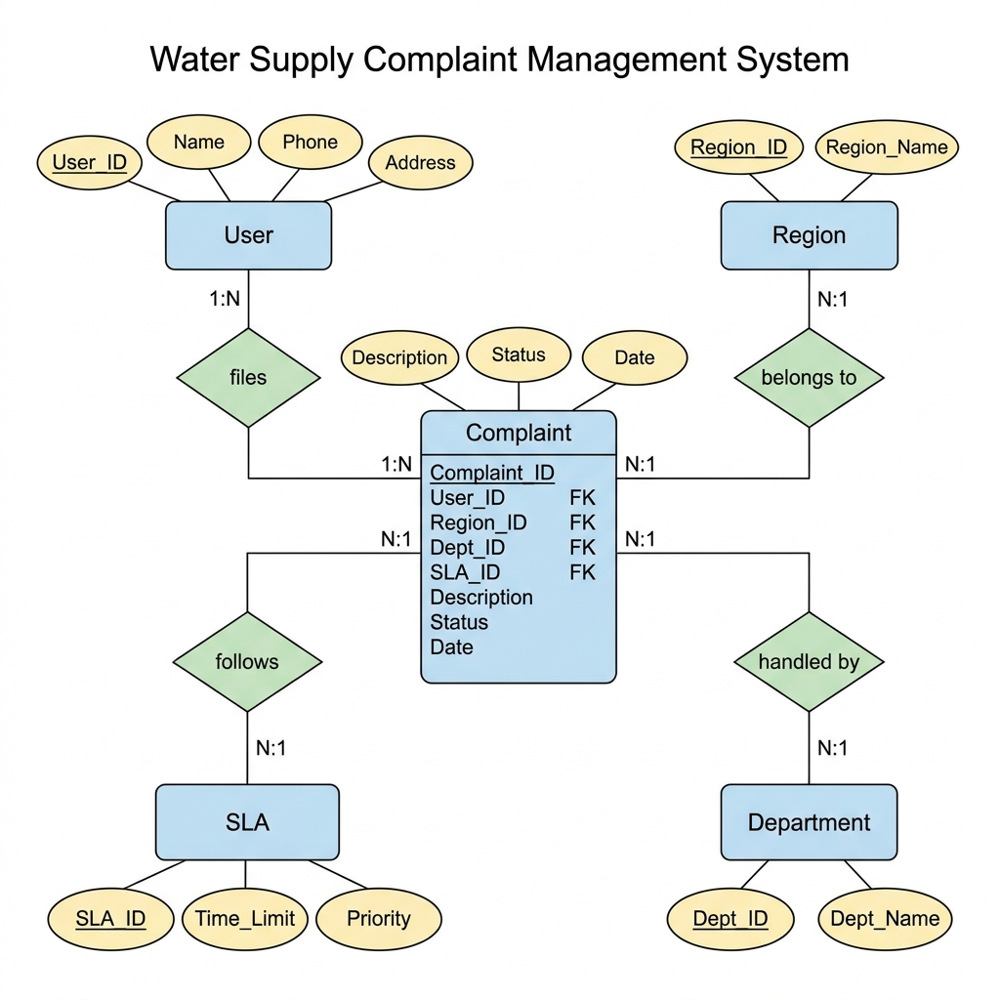

# 💧 Water Supply Complaint Management System

A **Database Management System (DBMS)** mini project that manages water supply complaints filed by citizens. Built using **MySQL**, this project demonstrates relational database design with proper normalization, constraints, and SQL querying.

> **Course**: Database Management Systems (DBMS)  
> **Level**: B.Tech 1st Year  

---

## 📋 Features

- **Complaint Registration** — Citizens can file complaints about water supply issues
- **Status Tracking** — Track complaints through stages: Pending → In Progress → Resolved → Closed
- **SLA Monitoring** — Service Level Agreements with priority levels (Critical, High, Medium, Low) and time limits
- **Region-Based Assignment** — Complaints are categorized by geographic region for efficient handling
- **Department Routing** — Each complaint is assigned to the relevant department (Pipeline, Water Quality, Billing, etc.)
- **Views & Indexes** — Pre-built views for quick reporting and indexes for query performance

---

## 🗂️ Project Structure

```
Water-Supply-Complaint-DBMS/
├── README.md            # Project documentation
├── schema.sql           # Database schema (tables, views, indexes)
├── sample_data.sql      # Sample data (Indian context)
├── queries.sql          # 28 SQL queries with examples
└── er_diagram.png       # Entity-Relationship diagram
```

---

## 🗄️ Database Tables

| Table        | Description                                | Primary Key    |
|--------------|--------------------------------------------|----------------|
| **User**     | Citizens who file complaints               | `User_ID`      |
| **Complaint**| Water supply complaints with status & date | `Complaint_ID` |
| **Region**   | Geographic regions/zones                   | `Region_ID`    |
| **Department** | Departments handling complaints          | `Dept_ID`      |
| **SLA**      | Service Level Agreements (priority & time) | `SLA_ID`       |

### Key Constraints

- **Primary Keys** on all tables
- **Foreign Keys** linking Complaint → User, Region, Department, SLA
- **NOT NULL** on critical fields
- **UNIQUE** on Phone (User) and Region_Name / Dept_Name
- **CHECK** constraints on Status and Priority values
- **DEFAULT** value for Status (`Pending`) and Date (`CURRENT_DATE`)

---

## 📊 ER Diagram



### Relationships

| Relationship               | Type | Description                          |
|----------------------------|------|--------------------------------------|
| User **files** Complaint   | 1:N  | One user can file many complaints    |
| Complaint **belongs to** Region | N:1 | Many complaints belong to one region |
| Complaint **handled by** Department | N:1 | Many complaints handled by one dept |
| Complaint **follows** SLA  | N:1  | Many complaints follow one SLA level |

---

## 📝 SQL Queries Included

The `queries.sql` file contains **28 queries** organized into 7 sections:

| Section | Topics | Query Count |
|---------|--------|-------------|
| Basic SELECT | View all records, sorting | 5 |
| WHERE Clause | Filtering by status, date, name | 5 |
| JOIN Queries | Inner joins, left joins, multi-table joins | 5 |
| GROUP BY | Aggregates, counts, averages | 5 |
| Subqueries | Nested queries, HAVING clause | 3 |
| Views | Pre-built reporting views | 3 |
| UPDATE/DELETE | Data modification examples | 2 |

---

## 🚀 How to Run

### Prerequisites

- **MySQL** 8.0+ installed ([Download MySQL](https://dev.mysql.com/downloads/mysql/))
- MySQL command-line client or a GUI tool like **MySQL Workbench**

### Steps

1. **Clone the repository**
   ```bash
   git clone https://github.com/<your-username>/Water-Supply-Complaint-DBMS.git
   cd Water-Supply-Complaint-DBMS
   ```

2. **Create the database and tables**
   ```bash
   mysql -u root -p < schema.sql
   ```

3. **Insert sample data**
   ```bash
   mysql -u root -p < sample_data.sql
   ```

4. **Run queries**
   ```bash
   mysql -u root -p < queries.sql
   ```

   Or open `queries.sql` in MySQL Workbench and run queries individually.

### Using MySQL Workbench

1. Open MySQL Workbench and connect to your server
2. Go to **File → Open SQL Script**
3. Open `schema.sql` and click **Execute** (⚡)
4. Open `sample_data.sql` and click **Execute** (⚡)
5. Open `queries.sql` and run queries one by one to see results

---

## 🛠️ Technologies Used

- **MySQL 8.0** — Relational Database Management System
- **SQL** — Structured Query Language for data definition and manipulation

---

## 📄 License

This project is open source and available for educational 
